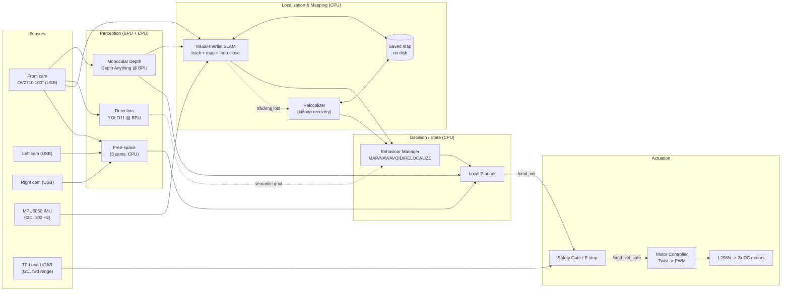
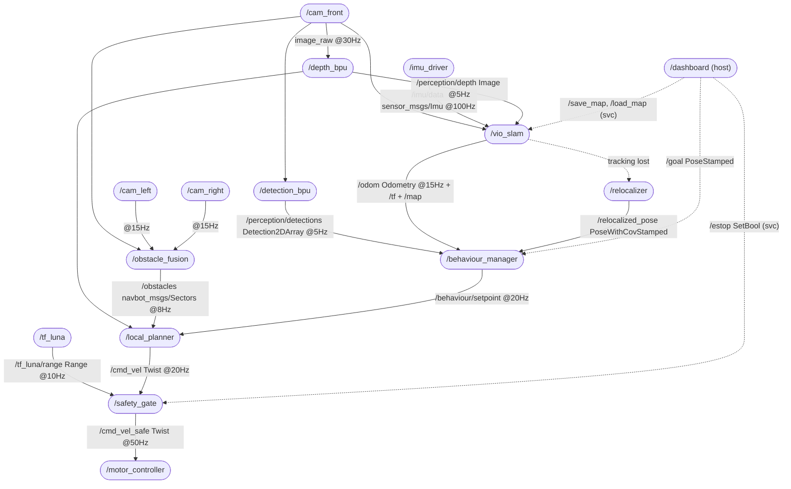

# RDK X5 Tri-Cam NavBot — Proposal

> **Version:** 1.0 &nbsp;|&nbsp; **Date:** 2026-06-26 &nbsp;|&nbsp; **Author:** Richard Muhirwa &nbsp;|&nbsp; **Board:** D-Robotics RDK X5
> **Stage:** 2 (Concept → Architecture → Engineering Plan)

A surround-vision indoor robot that **maps its environment and navigates to a goal using three USB
cameras + an IMU** — no wheel encoders, no GPS — and **recovers its own pose after being picked up and
moved (the "kidnapped robot" problem)**. The brain is the RDK X5: the BPU runs **monocular depth
(Depth Anything) and object detection**, while the 8× A55 CPU runs visual-inertial SLAM, planning and
the open-loop motor controller.

This single document aggregates **Challenge 1 (Concept)**, **Challenge 2 (Architecture)** and
**Challenge 3 (Engineering Plan)**. The roadmap lives in [`ROADMAP.md`](ROADMAP.md); the bill of
materials in [`docs/bom.md`](docs/bom.md).

---

## Table of Contents
- [Challenge 1 — Concept & Application Design](#challenge-1--concept--application-design)
- [Challenge 2 — AI System Architecture](#challenge-2--ai-system-architecture)
- [Challenge 3 — Engineering Plan](#challenge-3--engineering-plan)
- [Competency traceability](#competency-traceability)

---

# Challenge 1 — Concept & Application Design

### Scenario — operating environment and constraints

| Aspect | Specification |
|---|---|
| Environment | **Indoor**, flat floor (office / lab / corridor / arena), static + slow moving obstacles |
| Mission | **Map** the space (SLAM), then **navigate to a saved goal location**; survive a **kidnap** (operator lifts and re-places the robot) by **relocalizing** against the map |
| Lighting | Office lighting, **150–800 lux**; must tolerate ±2 EV variation without losing tracking |
| Surface | Hard floor with visual texture (tiles, carpet seams) — required for visual features |
| Connectivity | **Fully on-board / offline** — no cloud, no host PC in the loop at demo time; map saved to disk |
| Latency budget | **Sensor → motor command ≤ 150 ms** end-to-end (perception + planning + actuation) |
| Power | Untethered battery operation, ≥ **20 min** continuous run |
| Speed | Open-loop drive, **0.2–0.4 m/s** cruise (deliberately slow — no encoders, see Innovation) |

### User — who benefits and primary interaction mode

- **Primary user:** a non-expert operator who drives/places the robot to map a room once, saves a goal
  location, and from then on presses *Go* to have it navigate there autonomously — even after the robot
  is picked up and set down somewhere else.
- **Interaction mode:** headless autonomy. Operator interacts via a **laptop/phone on the same Wi-Fi**
  (RViz2 / a small web dashboard) to set the goal and watch live detections + the robot's pose.
  After *Go* the robot is autonomous; the only manual control is an **E-stop**.
- **Beneficiaries:** educational/research teams needing a low-cost ($ < 150 compute+sensing) mobile
  platform that does real on-device AI; and anyone evaluating **encoderless, vision-only navigation**.

### Core AI capabilities (high level)

| Layer | Capability | Where |
|---|---|---|
| **Perception** | (a) **Monocular depth** (Depth Anything) on the front camera → metric-ish depth for mapping & obstacles; (b) object detection (COCO, YOLO11) for semantic goals; (c) free-space from the 3-cam surround | **BPU** (depth + detection, time-shared) + CPU (free-space) |
| **Localization & mapping** | **Visual-inertial SLAM**: fuse front-camera features + **MPU6050 IMU** for pose; build & save an occupancy/feature **map**; **global relocalization** to recover pose after a kidnap | CPU (IMU pre-integration + SLAM back-end) |
| **Decision** | Finite-state behaviour manager (MAP → NAVIGATE → AVOID → **RELOCALIZE** → ARRIVED) + a local planner that turns depth/free-space + the goal pose into a velocity command | CPU |
| **Actuation** | Open-loop differential drive: `Twist` → left/right PWM duty cycles → L298N → DC geared motors; safety gate can override to 0 | CPU + GPIO/PWM |

### Innovation / differentiation (vs. a stock demo)

1. **Encoderless visual-inertial localization + kidnap recovery.** A stock demo assumes wheel odometry
   and never loses its pose. We have **no encoders** and explicitly handle the **kidnapped-robot
   problem**: VIO (front cam + MPU6050) for tracking, a saved map, and **global relocalization** to
   recover pose after being lifted and moved. This is the non-trivial core.
2. **Monocular metric depth on the edge BPU.** We convert **Depth Anything** to the Horizon BPU format
   (`.bin`) so a single cheap camera yields dense depth — turning three commodity USB cameras into a
   mapping/obstacle sensor without a stereo rig or a real LiDAR. (Conversion guide:
   [`docs/depth_anything_conversion.md`](docs/depth_anything_conversion.md).)
3. **3 cameras on a single USB port + one BPU.** All three streams share **one** RDK X5 USB 3.0 port
   via a hub; the BPU **time-shares** depth (primary) and detection (secondary) so neither the USB bus
   nor the BPU is the bottleneck.
4. **Open-loop motor calibration table.** Without encoders we build a **measured duty-cycle → velocity
   lookup** (per surface) and close the loop *visually* via SLAM instead of electrically — reproducible.
5. **Graceful degradation.** Every module has a defined failure mode (see Challenge 2). If tracking is
   lost, the robot stops and enters **RELOCALIZE** rather than driving blind.

### Measurable goals / success criteria

| Metric | Target | How measured |
|---|---|---|
| Monocular depth throughput (BPU) | **≥ 5 FPS** on front cam | on-device timing |
| Object detection throughput (BPU, time-shared) | **≥ 5 FPS** (proven 10 FPS solo) | FPS overlay |
| Surround free-space update rate | **≥ 8 Hz** combined (3 cams) | `ros2 topic hz /obstacles` |
| End-to-end latency (image → `/cmd_vel`) | **≤ 150 ms** p95 | timestamp diff in bag |
| SLAM / VIO drift | **≤ 5 % of path length** over a 10 m loop (with loop closure) | tape-measured vs `/odom` |
| Mapping coverage | build a usable map of a **≥ 30 m²** room with **≥ 1 loop closure** | inspect saved map |
| **Kidnap recovery** | after lift-and-move, **relocalize within ≤ 10 s** and **≤ 30 cm / 15°** of truth | timed, tape-measured |
| Mission success: navigate to saved goal (incl. 1 kidnap) | **≥ 8 / 10 runs** | manual scoring |
| Collision rate | **0 hard collisions** in a scored run (E-stop counts as fail) | observation |
| Continuous runtime on battery | **≥ 20 min** | stopwatch |

---

# Challenge 2 — AI System Architecture

## 2.1 System flow diagram (sensors → AI → planning/state → actuators)



## 2.2 Module design (responsibilities, I/O, failure modes)

| Module | Responsibility | Inputs | Outputs | Failure mode → handling |
|---|---|---|---|---|
| **Camera drivers ×3** | Capture + MJPEG decode, publish frames | 3× `/dev/v4l/by-path/*` | `*/image_raw`, `*/camera_info` | Device drop / USB reset → driver auto-reopens; publishes *stale* flag |
| **IMU driver** | Read MPU6050, publish accel+gyro | I2C5 @ 0x68 | `/imu/data` (100 Hz) | I2C read fail → mark stale; SLAM widens covariance |
| **Depth (BPU)** | Depth Anything `.bin` → dense depth map | `cam_front/image_raw` | `/perception/depth` | BPU busy → skip frame (drop, don't queue); model fail → node exits, supervised restart |
| **Detection (BPU)** | YOLO11 → semantic labels (time-shared with depth) | `cam_front/image_raw` | `/perception/detections` | Lower priority than depth; starved → drop rate, never blocks depth |
| **Free-space** | Per-camera ground/obstacle split → fused sectors | 3× `image_raw` (+depth) | `/obstacles` | One cam stale → that sector **unknown = blocked** (fail-safe) |
| **VIO SLAM** | Fuse front-cam features + IMU → pose; build/save map; loop-closure | `cam_front/image_raw`, `/imu/data`, `/perception/depth` | `/odom`, `/tf`, `/map`, map file | Low texture/blur → covariance inflates; tracking lost → signal Behaviour Manager → RELOCALIZE |
| **Relocalizer** | Match current view to saved map → recover global pose (kidnap) | `cam_front/image_raw`, saved map | `/relocalized_pose` | No match → keep robot stopped & rotating-search until confidence threshold |
| **Behaviour Manager** | State machine MAP/NAVIGATE/AVOID/RELOCALIZE/ARRIVED; owns goal | `/odom`, `/perception/detections`, `/goal`, reloc status | `/behaviour/setpoint` | Conflicting/stale inputs → default to STOP; watchdog on inputs |
| **Local Planner** | Combine free-space/depth + goal → safe `Twist` | `/obstacles`, `/perception/depth`, setpoint | `/cmd_vel` | No safe direction → rotate-in-place to search; never forward into blocked |
| **Safety Gate** | Hard override; clamp/zero `/cmd_vel` | `/cmd_vel`, `/tf_luna/range`, `/estop` | `/cmd_vel_safe` | Range < 0.3 m or E-stop → force `0`; intentionally simple & always trusted |
| **Motor Controller** | Map `Twist`→duty (LUT), drive L298N IN1–4 + ENA/ENB PWM | `/cmd_vel_safe` | GPIO/PWM to L298N | Input timeout (>200 ms) → coast to stop (dead-man) |

## 2.3 Compute allocation (BPU / CPU / host)

The RDK X5 has an **8-core Arm Cortex-A55 CPU** and a **~10-TOPS Bayes-e BPU**. No host offload at
demo time (everything on-board). Wi-Fi host is **dev/monitoring only**.

| Workload | Engine | Core affinity (suggested) | Expected utilisation | Real-time constraint |
|---|---|---|---|---|
| **Depth Anything inference (primary)** | **BPU** core 0 | — | ~5–8 FPS, BPU ~60–80 % | soft, ~150 ms/frame |
| **YOLO11 detection (secondary, time-shared)** | **BPU** core 0 | — | ~5 FPS, fills spare BPU | soft, lowest priority — never preempts depth |
| MJPEG decode ×3 cameras | CPU | cores 1–2 | 25–40 % | soft |
| Free-space (classic CV, 3 cams) | CPU | core 3 | 20–35 % | 8 Hz |
| **VIO SLAM** (front track + IMU + back-end) | CPU | cores 4–5 | 40–70 % | 15 Hz track / async map |
| IMU driver (MPU6050) | CPU | core 5 | < 5 % | 100 Hz |
| Behaviour + planner + relocalizer | CPU | core 6 | 10–25 % | 20 Hz (reloc bursty) |
| Safety gate + motor (PWM) | CPU | core 7 (isolated, RT prio) | < 10 % | **hard, 50 Hz, jitter < 5 ms** |
| ROS 2 DDS / logging / spare | CPU | shared | variable | — |
| Web dashboard / RViz bridge | **Host (Wi-Fi)** | off-board | — | none (best-effort) |

> **BPU sharing:** one BPU runs **two** models. Depth is the priority (mapping depends on it); detection
> is scheduled on spare BPU time and may drop to ~3–5 FPS — acceptable since detection only supplies
> *semantic* goals, not the control loop. If depth + detection can't co-exist (Risk R4), detection is
> disabled during MAP/NAVIGATE and run only on demand.
> **USB budget:** the 3 UVC **USB 2.0** cameras share one host port's 480 Mbps HS bus (the USB 3.0 hub
> doesn't widen this). Front @ 1280×720 MJPEG ~30 fps, sides @ 640×480 MJPEG ~15 fps; sides drop to
> 10 fps / 320×240 if frames are dropped (Risk R2).

### Module → thread/process / core / RT table (Standard-of-completion table)

| Module | Process | Thread model | Core affinity | RT class | Period |
|---|---|---|---|---|---|
| cam_front / cam_left / cam_right | 3 procs | 1 capture + 1 decode thread each | 1–2 | SCHED_OTHER | 33 / 66 ms |
| depth_bpu (+ detection_bpu) | 1–2 procs | inference + ROS thread; BPU queue | 0 (BPU) | SCHED_OTHER nice -10 / det nice 0 | ~150 / ~200 ms |
| obstacle_fusion | 1 proc | 3 worker + 1 fuse | 3 | SCHED_OTHER | 125 ms |
| vio_slam (+ imu_driver) | 1 proc | track + back-end + IMU thread | 4–5 | SCHED_OTHER nice -5 | 66 ms / 10 ms |
| behaviour_planner (+ relocalizer) | 1 proc | single + reloc worker | 6 | SCHED_OTHER | 50 ms |
| safety_motor | 1 proc | control loop (isolated) | 7 | **SCHED_FIFO prio 80** | 20 ms |

## 2.4 ROS 2 node graph



**Topic / interface table**

| Interface | Type | Kind | Rate | Producer → Consumer |
|---|---|---|---|---|
| `/cam_front/image_raw` | `sensor_msgs/Image` | topic | 30 Hz | cam_front → depth, det, slam, obs |
| `/cam_left/image_raw` · `/cam_right/image_raw` | `sensor_msgs/Image` | topic | 15 Hz | side cams → obstacle_fusion |
| `/imu/data` | `sensor_msgs/Imu` | topic | 100 Hz | imu_driver → vio_slam |
| `/tf_luna/range` | `sensor_msgs/Range` | topic | 10 Hz | tf_luna → safety_gate |
| `/perception/depth` | `sensor_msgs/Image` (32FC1/16UC1) | topic | 5 Hz | depth_bpu → slam, planner |
| `/perception/detections` | `vision_msgs/Detection2DArray` | topic | 5 Hz | detection_bpu → behaviour |
| `/odom` (+`/tf`, `/map`) | `nav_msgs/Odometry`, `OccupancyGrid` | topic | 15 Hz / async | vio_slam → behaviour, planner |
| `/relocalized_pose` | `geometry_msgs/PoseWithCovarianceStamped` | topic | on-event | relocalizer → behaviour |
| `/obstacles` | `navbot_msgs/Sectors` (custom) | topic | 8 Hz | obstacle_fusion → planner |
| `/behaviour/setpoint` | `geometry_msgs/Twist` | topic | 20 Hz | behaviour → planner |
| `/cmd_vel` | `geometry_msgs/Twist` | topic | 20 Hz | planner → safety_gate |
| `/cmd_vel_safe` | `geometry_msgs/Twist` | topic | 50 Hz | safety_gate → motor |
| `/goal` | `geometry_msgs/PoseStamped` | topic | on-demand | dashboard → behaviour |
| `/estop` | `std_srvs/SetBool` | **service** | on-demand | dashboard → safety_gate |
| `/save_map` · `/load_map` | `navbot_msgs/MapIO` | **service** | on-demand | dashboard → vio_slam |
| `/calibrate_drive` | `navbot_msgs/Calibrate` | **action** | on-demand | tool → motor (duty↔velocity LUT) |

> TROS mapping: `cam_*` use **`hobot_usb_cam`** (one node per camera, namespaced); depth and detection
> wrap **`hobot_dnn` / `dnn_node`** with the compiled `depth_anything_*_nv12.bin` and
> `yolo11_*_nv12.bin`; `hobot_codec` handles JPEG↔NV12. VIO SLAM is a CPU node (e.g. an ORB/VINS-style
> or RTAB-Map-style back-end). Custom `navbot_msgs` package holds `Sectors`, `Calibrate`, `MapIO`.

---

# Challenge 3 — Engineering Plan

See [`docs/bom.md`](docs/bom.md) for the full Bill of Materials and [`ROADMAP.md`](ROADMAP.md) for the
week-by-week timeline. Summaries below.

## 3.1 BOM (summary — full table in docs/bom.md)

| Part | Qty | Interface | Note |
|---|---|---|---|
| RDK X5 (8×A55, ~10 TOPS BPU) | 1 | — | brain; supplied |
| HBVCAM OV2710 100° (front) | 1 | USB-2 UVC | MJPEG, 1280×720 |
| Wide-angle USB camera (sides) | 2 | USB-2 UVC | left + right |
| 4-port **USB 3.0** hub / extender | 1 | 1 X5 USB port | all 3 cams share one port (Risk R4) |
| **MPU6050 IMU** | 1 | I2C5 @ 0x68 | 6-axis; enables VIO + kidnap recovery |
| DC geared motor (no encoder) | 2 | — | differential drive |
| L298N motor driver | 1 | GPIO + PWM | ENA/ENB = PWM, IN1–4 = dir |
| TF-Luna LiDAR | 1 | I2C5 @ 0x10 | forward safety range (already wired) |
| Battery + 5V/UBEC regulator | 1 | — | board 5V/3A clean; motors separate rail |
| Chassis, wheels, caster | 1 | — | differential platform |

## 3.2 Timeline / Roadmap (summary)

| Week | Milestone |
|---|---|
| W1 | Repo + 3-camera bring-up, all streams in ROS 2 simultaneously |
| W2 | Motor controller + L298N + duty↔velocity calibration table; E-stop |
| W3 | Detection node on BPU integrated as ROS topic; obstacle fusion v1 |
| W4 | Visual odometry node + `/odom` + drift test |
| W5 | Behaviour manager + reactive planner; first closed-loop drive |
| W6 | Full integration, latency tuning, RT core pinning |
| W7 | **Stage 3 demo**: scored mission runs + recorded bag |

Full week-by-week detail (with exit criteria per week) is in [`ROADMAP.md`](ROADMAP.md).

## 3.3 Risk analysis (top 5)

| # | Risk | Likelihood × Impact | Mitigation | Trigger to pivot |
|---|---|---|---|---|
| **R1** | **Kidnap relocalization fails** / VIO drifts too much | M × H | MPU6050 → VIO; loop-closure; appearance-based place recognition over saved map; slow speed | Reloc > 10 s or > 30 cm in W5 → add fiducial/AprilTag anchors in the arena |
| **R2** | **Depth Anything won't convert / runs too slow** on BPU | M × H | Use a **small** Depth Anything (ViT-S/encoder) at 256–384 px; INT8 calib; verify accuracy vs TF-Luna | Depth < 3 FPS or unusable accuracy → fall back to TF-Luna + free-space only mapping |
| **R3** | **BPU contention** (depth + detection on one BPU) | H × M | Depth = priority; detection on spare time / on-demand only | BPU > 90 % sustained → disable detection during MAP/NAV |
| **R4** | **3 USB-2 cameras saturate the single host port** | H × M | MJPEG; lower side res/fps; the USB 3.0 hub helps power/reach not HS bandwidth | Side frame drops > 20 % → sides to 10 fps / 320×240 |
| **R5** | **Open-loop motors** drive unequally (no encoders) | H × M | Per-motor duty trim (`drive_lut.yaml`); SLAM heading correction | Heading error > 15°/m straight → add cheap optical-flow ground sensor |

## 3.4 GitHub project structure

```
rdk-x5-navbot/
├── README.md                 # overview, quickstart, links
├── PROPOSAL.md               # this file — Challenge 1-3 aggregated
├── ROADMAP.md                # week-by-week milestones + exit criteria
├── LICENSE
├── docs/
│   ├── bom.md                # full bill of materials (+ est. cost)
│   ├── architecture.md       # extended diagrams / decisions (ADR)
│   └── images/               # exported PNG/SVG diagrams
├── src/                      # ROS 2 packages (colcon workspace `src`)
│   ├── navbot_bringup/       # launch + params for the whole robot
│   ├── navbot_msgs/          # custom msgs/srvs/actions (Sectors, Calibrate, MapIO)
│   ├── navbot_cameras/       # 3-cam bring-up (wraps hobot_usb_cam)   [DONE]
│   ├── navbot_perception/    # depth (BPU) + detection (BPU) + obstacle fusion
│   ├── navbot_slam/          # VIO SLAM + relocalizer + IMU (MPU6050) driver
│   ├── navbot_navigation/    # behaviour manager + local planner
│   └── navbot_drive/         # motor controller + safety gate (L298N)  [motor DONE]
├── launch/                   # top-level / convenience launch files
├── models/                   # compiled BPU .bin (depth_anything, yolo11) + convert/download.sh
├── config/                   # YAML params, camera calib, duty↔vel LUT
└── scripts/                  # bench tests, calibration, bag analysis
```

**Conventions:** ROS 2 Humble, `colcon` build, `ament_cmake`/`ament_python`; branches
`feat/*` `fix/*`; conventional commits; one package = one responsibility; params in `config/*.yaml`
(never hard-coded); every node has a launch entry and a bench-test script under `scripts/`.

---

# Competency traceability

| Stage-2 competency | Where demonstrated |
|---|---|
| Requirements → architecture traceability | C1 success-criteria table → C2 modules/topics that produce each metric |
| ROS 2 graph design & message design | §2.4 node graph + topic/type/rate table + custom `navbot_msgs` |
| On-device resource budgeting (BPU vs CPU) | §2.3 compute allocation + core-affinity/RT table |
| Risk-driven iteration & test planning | §3.3 risks with numeric pivot triggers + per-week exit criteria in ROADMAP |
