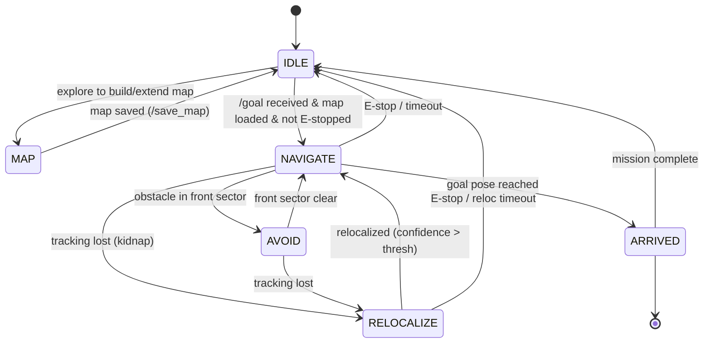
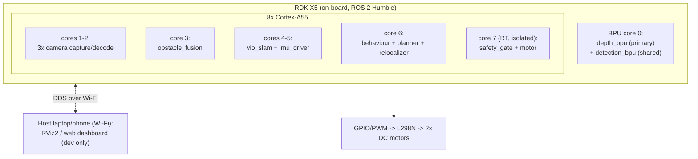

# Architecture & Design Decisions

> **Version:** 1.0 &nbsp;|&nbsp; **Date:** 2026-06-26

Extended detail behind [`PROPOSAL.md` Challenge 2](../PROPOSAL.md#challenge-2--ai-system-architecture).
The canonical flow, node graph, and compute tables live in the proposal; this file records the
**why** (lightweight ADRs) and the deployment-time view.

## Behaviour state machine

## Architecture Decision Records (ADRs)

### ADR-1 — BPU runs depth (primary) + detection (time-shared); SLAM/CV on CPU
**Context:** one BPU (~10 TOPS). **Depth Anything** is the mapping/obstacle sensor and must run every
frame possible; YOLO11 only supplies *semantic* goals. SLAM feature tracking is cheap classic CV.
**Decision:** **depth = priority** on the BPU; **detection = lowest priority**, scheduled on spare BPU
time (and disabled during MAP/NAV if needed). VIO SLAM front-end + free-space run on CPU cores.
**Consequence:** depth FPS is protected; detection degrades gracefully (Risk R3 covers the pivot).

### ADR-2 — Encoderless: close the loop via SLAM, calibrate open-loop
**Context:** DC geared motors with no encoders → no electrical velocity feedback.
**Decision:** build a measured **duty-cycle → velocity LUT** per surface (`config/drive_lut.yaml`), drive
open-loop from it, and correct heading/position using **VIO SLAM** (cameras + MPU6050) rather than wheel
ticks. **Consequence:** slow cruise (0.2–0.4 m/s) for predictability; relies on SLAM quality (Risk R1).

### ADR-5 — Kidnap recovery: separate relocalizer, not just continuous tracking
**Context:** continuous VIO assumes smooth motion; a kidnap teleports the robot and breaks tracking.
**Decision:** a dedicated **relocalizer** detects "tracking lost", matches the live view to the **saved
map** (appearance/place recognition), and republishes a global pose; Behaviour Manager enters
**RELOCALIZE** (stop + rotate-search) until confidence clears a threshold.
**Consequence:** the robot never drives on a bad pose; recovery is an explicit, testable state (Risk R1).

### ADR-3 — Fail-safe sectors: unknown == blocked
**Context:** a side camera can drop frames under USB load.
**Decision:** `obstacle_fusion` marks any sector with **stale/missing** data as **blocked**, not free.
**Consequence:** robot is conservative when blind; never drives into an un-observed sector.

### ADR-4 — Safety gate is a separate, dumb, trusted node
**Context:** planner/behaviour are complex and may hang or misbehave.
**Decision:** a minimal `safety_gate` node on an **isolated RT core** (SCHED_FIFO) clamps `/cmd_vel` to
zero on E-stop, TF-Luna proximity, or input timeout (dead-man).
**Consequence:** safety does not depend on the correctness of the AI stack.

## Deployment view (processes on the X5)

